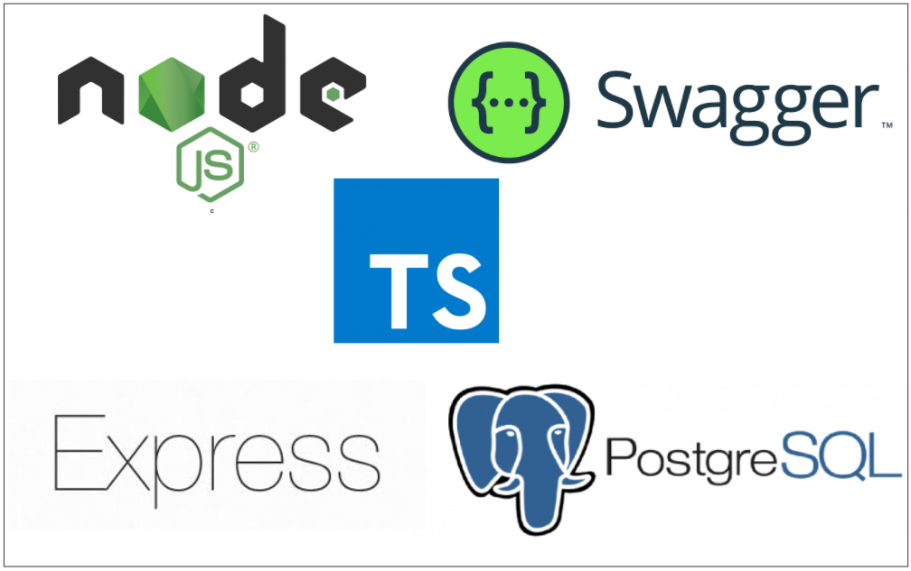

<div style="text-align: center;">
    
</div>

# NODE-TS-DOCKER

Este proyecto sirve como guía de referencia para la dockerización de proyectos Javascript, y Typescript. Con el objetivo de convertirse en recurso de consulta o punto de arranque de distintas implementacioneas con Docker.

# Arranque del proyecto

En un terminal indicando como directorio el directorio del proyecto

1. `npm i`

2. `tsc`

3. `node dist/app.js` ó `nodemon dist/app.js`


# Trabajando en Typescript

A continuación se indican detalles de como configurar este u otros proeyctos para trabajar con Node JS usando Typescript. Básicmante es una guía de las configuraciones que han sido necesarias para construir este proyecto y que servirían de patrón en caso de querer construir otro con Node JS y Typescript

## A. Crear archivo de configuración de trypescript (tsconfig.json)

1. Inicializar el compiler que genera el archivo
    
`tsc --init`

2. Se realizan las modifciaciones oportunas en el _tsconfig.json_

```
target='es6' // o el que proceda
outDir='./dist'
sourceMaps=true
moduleResolution='node'
```

3. Una vez realizadas en terminal `tsc`. Esto compila nuestros ficheros typescript y genera un 'app.js' interpretable por node y que es el fichero a servir con node app.js

## B. Configuración de reglas de códificación (tslint.json)

1. Instalar dependencia

    ```
    npm i tslint --save-dev
    ```

2. Tenemos que instalar typescript como dependencia local de desarrollo (aunque lo tengamos instalado globalmente también)

    `npm i typescript --save-dev`

3. Crear archivo de configuración de tslint. 

    `.\node_modules\.bin\tslint --init`

    Se crea un archivo de configuración con este contenido

```
{
    "defaultSeverity": "error",
    "extends": [
        "tslint:recommended"
    ],
    "jsRules": {},
    "rules": {
        "no-console": false
    },
    "rulesDirectory": []
}
```


## C. Visibilización de imports para TS

Debemos añadir esta dependencia de desarrollo para que se nos reconozcan los tipos de los imports `npm i --save-dev @types/express`

## D. Live reloading

Con `tsc --watch` dispondremos de una consola o terminal independiente para poder ver los cambios en caliente sobre el archivo que se esté ejecutando


# MIDDLEWARES

## Configuración de CORS

Para poder importar las CORS `npm i --save-dev @types/cors`

## Parseo del body

Para poder parsear el body que será el objeto json ( payload que llega a nuestro api en la req.body )
necesitamos aplicar este middleware con `app.use(express.json())`

## Servir contenido estático

Crearemos una carpeta a nivel de la raíz, por ejemplo 'public' y algún contenido como puede ser un index.html.

Definiremos el middleware  `app.use(express.static('public'))` referenciando la ruta de nuestra carpeta.


# ENTORNOS

## Gestión de entornos con el paquete 'dotenv'

1. Crear archivo .env en la raíz del proyecto
2. Instalar la dependencia del paquete _dotenv_ `npm i express cors dotenv`


## Variables de entorno

Estas son las variables que necesitaremos indicar para levantar el contenedor de nuestra aplicación correctamente

| Variable | Descripcion | Modo de uso
|---|---|---|
| APP_PORT | 4001 | Puerto cpersonalizado donde levantará la aplciación y la definición de Swagger |
| DB_NAME | postgredb |  nombre de la base de datos ---> Mantener en postgredb para que se cree automáticamente la tabla de trabajo por defecto. En caso de que se quiera indicar aquí otro nombre, habrá que crear en postgre esa base de datos manualmente |
| DB_HOST | _localhost_/<db_container_name> |  El host donde está levantada la base de datos. Será el nombre del contenedor de BD si la aplicación se levanta dockerizada y no con npm run start. |
| DB_PORT | 5432 |  Puerto de la base de datos PostgreSql por defecto el 5432 |
| DB_USER | _postgres _ |  El usuario de base de datos, por defecto _postgres_ |
| POSTGRES_DEFAULT_EMAIL |postgres |  Email por defecto de la base de datos postgres |
| DB_PASS | 4d1ff1cul7p455w0rd |  Contraseña de acceso a la base de datos y al gestor pgAdmin |
| JWT_SECRET | 4d1ff1cul753cr37 |  El secreto personalizado en base al cual codificar los tokens con jwt |


# DOCKER

## Generar la imagen Docker

```
docker build --tag node-ts .
```

## Levantar contenedor

```
docker run -p 4410:4410 -p 3000:3300 node-ts
```

Por defecto al levantar una aplicación con node compose se va a consumir el fichero de entrono .env que se encuentra a mismo nivel de estrucutra de proyecto que el docker-compose.yml

No obstante podemos disponser de varios ficheros de entorno y levantar de forma personalizada

```
docker compose --env-file <NOMBRE_FICHERO.env> up
```

Ejemplo: 

```
docker compose --env-file production.env up
```

## MODOS DE TRABAJO

## _MODO 1: APLICACIÓN ARRANCADA EN LOCAL - BD DOCKERIZADA o EXTERNA_ 

Arrancar aplicación con `npm run start` y establecer las variables de entorno en el _.env_ conforme a cómo esté levantada la base de datos. 
Si la base de datos se encuentra en otro docker localmente, el host de la misma será _localhost_ o lo que es lo mismo 127.0.0.1

- DB_HOST=localhost


##  _MODO 2: DOCKERIZACIÓN COMPLETA_

Se hace uso del fichero _production.env_ o un fichero de variables de entorno que tenga en cuenta esto - DB_HOST=<NOMBRE_CONTENEDOR_BASE_DE_DATOS> (no localhost)

> IMÁGEN 

Si no está construída, es imprescindible generar la imagen a través del Dockerfile


    docker build --tag node-ts .


> ENTORNO

Hacemos uso del _docker-compose.yml_ ejecutando la instrucción


    docker compose --env-file production.env up // O cualquier fichero .env en la misma raíz que tengo como DB_NAME  el nombre del contenedor domnde está lavantada la base de datos (nunca localhost)

desde la ruta donde se encuentra el fichero docker-compose.yml

> RED

Aunque no hace falta crear la res a través de comandos, sí que debemos especificar en el docker-compose.yml que todos los contenedores usarán las misma red. Esto se hace identificando la propia red con un nombre que se asigna a cada imágen


    networks: # esto va a nivel de aplicación para cada uno de los servicios
        - my_network

networks: # esto va al primer nivel del .yml
    my_network:
        external: true # Recordar crear previamente la red my network con 'docker create my_network'


## _MODO 3: DOCKERIZACIÓN INDEPENDIENTE_

> IMÁGEN

Si no está construída, es imprescindible generar la imagen a través del Dockerfile

    
    docker build --tag node-ts .
    

> ENTORNO

En este caso, si hay contenedores separados, es decir, se ha levantado al aplicación node con `docker compose -f docker-compose-base.yml up` y la base de datos en otro contenedor distinto, será imprescindible que a ambos contenedores corriendo en nuestra máquina se les asoce la misma red.
En el fichero de variables de entorno se tiene que tener en cuenta que DB_HOST=<NOMBRE_CONTENEDOR_BASE_DE_DATOS>

> RED

Así pues empezaremos creando la red con:
    
    docker network create <NOMBRE_DE_LA_RED>
    

Ahora, en cada docker compose (también con los que levantamos postgres) debemos especificar lo siguiente para que se conecten a esa red cuando se construya el contenedor:
    
        networks: # esto va a nivel de aplicación
            - my_network # o el nombre que se desee pero que sea el mismo en todos los docker compose, el de la app y el de base de datos

    networks: # esto va al primer nivel del .yml
        my_network:
            external: true # Recordar crear previamente la red my network con `docker create my_network`


En este caso para que sólo se levante la aplicación, dando por supuesto que la base de datos se ha levantado mendiante su proceso concreto,
ejecutamos la instrucción:

   
    docker compose -f docker-compose-standalone.yml --env-file production.env up
   

De esta forma sólo se construye contenedor desde la imagen de la aplicación

En el docker compose por defecto 

  db:
    # <nombre del servicio 1>
    container_name: ${DB_NAME} ----> Este es el <NOMBRE_CONTENEDOR_BASE_DE_DATOS> que usaremos como dns interna


## _MODO 4: MODO DESARROLLO (BIND VOLUME)_

Se debe levantar la aplicación aplicando un bind volume en el docker compose que apunta a la ruta actual del proyecto.
Esta ruta debe ser modificada por la ruta raíz del proyecto si esto no coincide

   
    docker compose -f docker-compose-binded.yml --env-file ????????.env up
    

De esta forma los cambios en nuestra aplicación se verán reflejadas directamente en el contenedor. 


## Levantar contenedor a partir de un fichero de entorno concreto

```
docker compose -f docker-compose-base.yml --env-file production.env up 
```


## Levantar con una configuración de entorno específica

```
docker compose -f docker-compose-base.yml up
```


# Networks

## Listar redes
```
docker network ls 
```


## Conectar contenedor a una red
```
docker network connect <RED> <CONTENEDOR>
```

Ejemplo:

```
docker network connect cb2 b18
```


## Inspeccionar una red (obtener contenedores asociados)

```
docker network connect <RED> <CONTENEDOR>
```

Ejemplo:

```
docker network inspect <RED>
```


